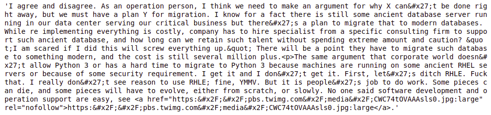

# Text Mining on Hacker News Corpus
This repo contains the scripts to do simple text mining and analysis on the public Hacker News data set. <br>

We also would seek to answer the following questions:
1. What are the trending topics? Can they be used as part of market research for seed acceleration purposes?
2. What should writers focus on?
3. Recent studies have found that many forums tend to be dominated by a very small fraction of users. Is this true of Hacker News?
4. Hacker News has received complaints that the site is biased towards Y Combinator startups. Do the data support this?

For a detail answers to these questions, please refer to `report.pdf`.

# Data
Hacker News is a social news website ran by investment fund and startup incubator, Y combinator. It focuses on computer science and entrepreneurship. he dataset we will be using is from an open source dataset containing all the posts from Hacker News from 2006 till date. For 2018 itself, there are approximately 1.9 million rows of data for analysis, with text data from 113169 unique users. 
 <br>

## Data Dictionary
 

## BigQuery
The complete dataset can be queried using Google Cloud Platform (GCP) from [here](https://cloud.google.com/bigquery/public-data/hacker-news). <br>

# Setup
## Requirements
To setup the project, you would need to have [Anaconda3](https://www.anaconda.com/download/) installed. 

## Conda Env
1. Clone the repo
```
git clone https://github.com/notha99y/TextMiningHackerNews.git
```
2. Set up conda environment
```
cd TextMiningHackerNews
conda env create -f=environment.yml
```

# Text Cleaning
## html encoding
Most of the text in the comments contain `html encoding` which we need to clean, either by dropping them or converting them to their intended display character. <br>

Fortunately, `Python3` has an `html` package which a method called `unescape` that quickly converts the `html encoding` to the human readable text. <br>

With a series of regex, we could clean the corpus till it is usable for us to performing text mining on. <br>

In preparing the data to train our word2vec model, we adopted the following pipeline:
1. Takes in raw corpus extracted from MongoDB
2. First round of cleaning
    - Remove comments with length < 5
    - Unescape html encoding
    - Remove html tags and unnecessary spaces
    - Decontraction
3. Sentence Tokenization
4. Second round of cleaning
    - Remove punctuation
5. Word Tokenization
6. Third round of cleaning
    - Stopwords removals,
    - POS tagging
    - POS filtering
        - Only allow Noun, Verbs, Adjectives and Adverbs
    - Lemmatize Noun and Verbs

An example is shown below:



<center> to </center>


# Topic Modelling
With the text cleaned, we can generatethe following illustrations to get a sense of what the users of Hacker News are chatting about. <br>

Below is summary of what most users are chatting about.


## Word Cloud

## Latent Dirichlet Allocation (LDA)


## Word2Vec
Upon training on the text data from 2016 to 2018, we achieve the following word2vec embedding:


To get the following visualization, open the `useful_links.txt` file and download the contents of the visualize_result into a new folder at the root directory of your project. Rename the folder to `visualize_result`. <br>

With that, run the following <br>
```
tensorboard --logdir visualize_result
```

# Personal Notes
## Pandas

`pd.read_table`
```python
# read general delimited file into DataFrame
pd.read_table('your_corpous.txt', header = None, names = ['your', 'columns', 'names'])
```
`df.groupby('class').describe()`
```python
# aggregation
```

`df.apply(your_function)`, `df.assign(col_name = Series)`
```pytohn
length = df['class'].apply(len) # alias
df = df.assign(Length = length) # creating a new column in the dataframe
```

## NLTK
`stopwords`
```python
from ntlk.corpus import stopwords
stopwords.words('English') #  show all the stops words in the corpus
# note: need to run ntlk.download() get books
```

`Tokenizer`
```python
import nltk
# words tokenizing
tokens = nltk.word_tokenize(text)

# sentence tokenizing
sentences = nltk.sent_tokenize(text)
```

`Lemmatizer`
```python
WNlemma = nlt.WordNetLemmatizer()

WNlemma.lemmatize('better', pos = 'a')
```

`df.apply()`, `tokenizer`, `stopwords`
```python
def pre_process(text):
    tokens = nltk.word_tokenize(text)
    tokens=[WNlemma.lemmatize(t) for t in tokens]
    tokens=[word for word in tokens if word not in stopwords.words('english')]
    text_after_process=" ".join(tokens)
    return(text_after_process)
```

`POS Tagging`
```python
import nltk
from nltk import word_tokenize
from nltk import pos_tag

# Step 1 tokenize the text
tokens = word_tokenize(text)

# Step 2 apply pos_tagging
pos_1 = pos_tag(tokens)
pos_2 = pos_tag(tokens, tagset = 'universal')
pos_3 = pos_tag(tokens, tagset = 'wsj')
pos_4 = pos_tag(tokens, tagset = 'brown')
```
## Sk-learn
`train-test-split`
```python
from sklearn.model_selection import train_test_split
X_train, X_test, y_train, y_test = train_test_split(df.X, df.Y, test_size = 0.2, random_state = 1)
```

### Document Term Matrix
A mathematical matrix that describes the frequency of terms that occur in a collection of document (corpus). <br>

`CountVectorizer()` produces a sparse representation of the counts using
`scipy.sparse.csr_matrix`
```python
from sklearn.feature_extraction.text import CountVectorizer
count_vect = CountVectorizer()
# 1. fit
x_train_counts = count_vect.fit_transform(x_train)
# 2. get_feature_names()
x_train_fnames = count_vect.get_feature_names()
# 3. From Dataframe
dtm = pd.DataFrame(x_train_counts.toarray(), columns = x_train_fnames)
```
### Term Frequency-Inverse Document Frequency
a numerical statistic that is intended to reflect how important a word is to a documents in a corpus. <br>

#### Usage
It is often used as a weighting factor in searches of information retrieval, text mining, and user modeling. 

#### Some notes using sklearn TfidfTransformer
if use_idf is set to `True`: Enable inverse-document-frequency reweighting.
```python
from sklearn.feature_extraction.text import TfidfTransformer
# 1. fit
tf_transformer = TfidfTransformer(use_idf=False).fit(x_train_count)
# 2. transform dataset
x_train_tf = tf_transformer.transform(x_train_count)
```
### Pipelining (SUPER USEFUL)
builds a pipeline to combine multiple steps into one
```python
from sklearn.pipeline import Pipeline
# 1. generate pipeline
text_clf = Pipeline([
    ('vect', CountVectorizer()),
    ('tfidf', TfidfTransformer()),
    ('clf', MultinomialNB())
])
# 2. fit
text_clf.fit(X_train, y_train)
#Test model accuracy
import numpy as np
from sklearn import metrics 
predicted = text_clf.predict(X_test)
print(metrics.confusion_matrix(y_test, predicted))
print(np.mean(predicted == y_test) )
```
